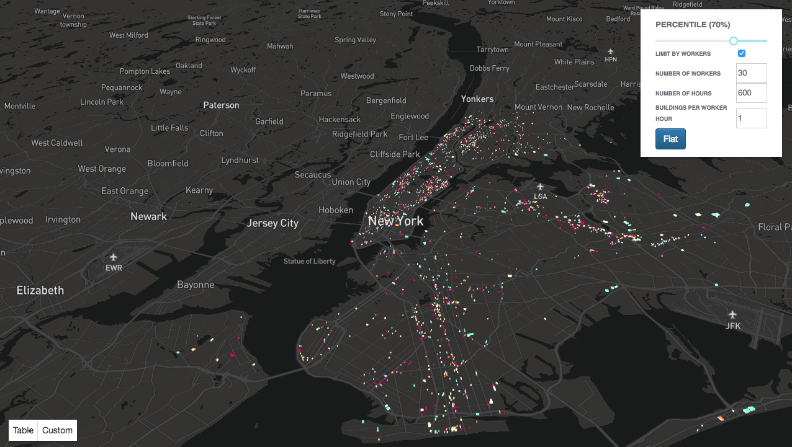

# Energy Benchmarking Operational Tool
**Authors**: Ben Steers, Te Du, Ian Xiao

This tool was created as part of a final project for Civic Analytics and Intelligence at NYU CUSP, under the advisement of Constantine Kontokosta. It aims to provide a practical outlet for the visualization and use of LL84 data and the benchmarking results from our final project.

The prototype tool aims to serve the needs of two populations:
* Operations managers
* Building owners



## Operational Management
Operational managers are often tasked with identifying the worst performing buildings in terms of energy usage efficiency, whether it be electricity, water, or fuel usage. Their criteria for selection is not fixed, so to accomodate varying use cases, a slider is provided that allows users to filter the displayed buildings by only showing the top percentile of worst performing buildings. So for example, if the slider is set to a value of 80%, it will only show the top 20% of buildings based on their EER score. The other constraint that operational managers may have is based on resource management. They can only address a certain number of buildings based on the number of workers they have, the amount of time they are looking over, and the rate at which their workers can inspect a single building. To accomodate this, filters are provided that allow building owners to specify the number of workers, the number of hours, and the number of buildings per worker per hour.


## Building Owners
Building owners may want to know how their building performs compared to their peers. The building owners who want to have this information are more likely to actually take action in improving their building efficiency so it is important to provide them with the support to become more informed building owners. The tool allows for building owners to input their building's characteristics and perform collaborative filtering to identify their optimal peer group and evaluate their performance in relation to that peer group.


## Technical Information
The tool was built using `deck.gl`, a WebGL framework built upon Mapbox GL and React.js for visualizing large datasets in a 3D mapping environment. The codebase is written in Javascript and works primarily on the front-end. A mini Flask web server is used to do benchmarking for custom building inputs using the collaborative filtering method. 

To run for the first time:
```bash
git clone https://github.com/td928/CAUI_team1_Final_Project.git
cd CAUI_team1_Final_Project
npm install
npm start
```

For subsequent runs, just do:
```bash
npm start
```

To enable custom building benchmarking functionality, open another terminal window, go to the same directory, and run:
```bash
export FLASK_APP=app.py
python -m flask run
```


## Future Improvements
* Add CSV export.
* Add dynamic colorbar. Currently the colorbar is meant to show relative efficiency, however the tool would benefit from having a quantitative reference to efficiency.
* Add building highlighting to only show buildings in the selected building peer group. Also add highlighting for displaying a custom building's peer group.
* Add toggles to switch efficiency scales to be based on water or natural gas usage.
* Add geocoded search based on address, BBL, etc.
* Add filters for building attributes.
* Extend modelling to other building types besides multi-family buildings and display them accordingly.
* Add smooth viewport transitions (not supported in the current release of deck.gl or react-map-gl, but is available in the dev release).
* Add building zoom to/highlighting for table row hover/click.
* In histograms, draw a marker signifying the referenced building's relative efficiency compared to its peer group distribution.
* Automatically generate benchmarking results annually as new LL84 results are posted.
* Once more information is available about building systems, recommendations for how to improve building efficiency could be provided in a personalized manner.

